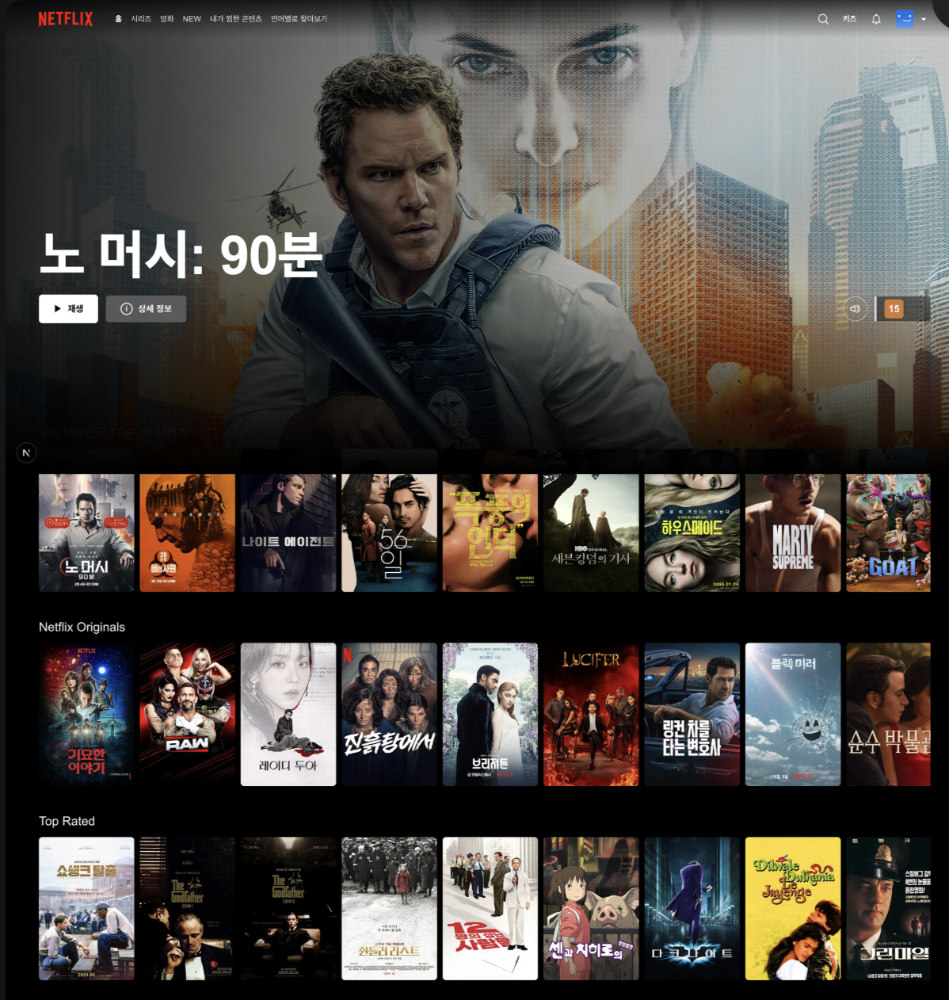
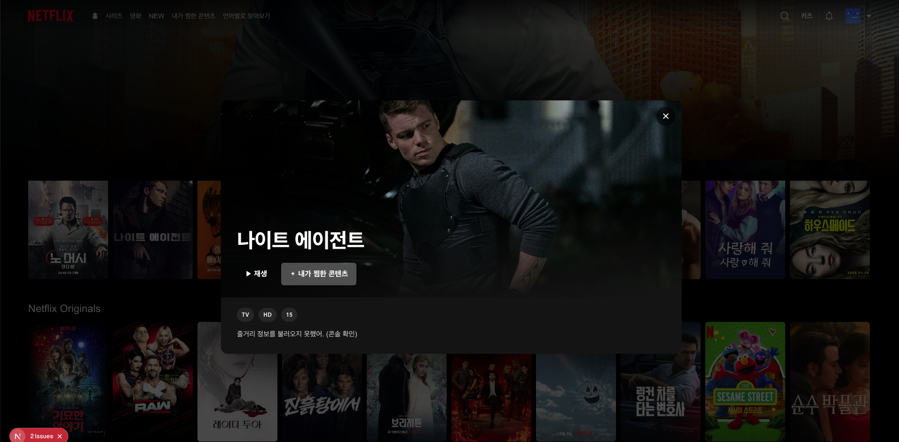
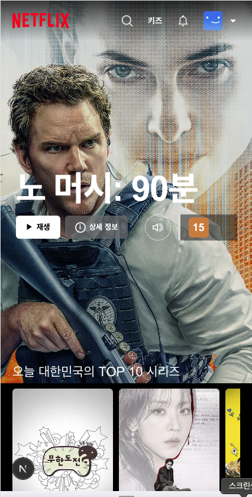

# 🎬 Netflix Clone Project (TMDB API)

Next.js App Router와 TMDB API를 활용해 넷플릭스 UI/UX를 구현한 웹 애플리케이션입니다.  
UI 계층과 데이터 계층을 분리해 유지보수성과 확장성을 높였습니다.

## 📸 화면 구현 (UI/UX)

### 메인 홈 화면
히어로 섹션과 카테고리 Row(Top 10, Netflix Originals, Top Rated) 렌더링



### 상세 모달 화면
콘텐츠 클릭 시 상세 모달 오픈, ESC/오버레이 닫기, 상세 데이터 상태 처리



### 팀원 추가 수정 캡처 (2026-02-21)
Row 카드 섹션 가림 이슈 및 헤더 모바일 대응 관련 팀원 공유 캡처


### 2026-02-21 추가 수정 반영 내용 (PR #9)
- `src/hooks/useHeroTrailer.ts` 신규 추가
  - 트레일러 재생/닫기 로직을 페이지 컴포넌트에서 분리
- `src/app/page.jsx`
  - `useHeroTrailer` 훅 적용
  - Row key 보강(`row.key ?? row.title`) 및 UI 코드 정리
- `src/components/Nav.css`
  - 모바일 구간(`@media (max-width: 768px)`)에서 좌우 패딩 축소 및 메뉴 숨김 처리 추가
- `src/api/mapper.ts`, `src/api/requests.js`, `src/api/tmdb.ts`
  - 홈 화면 데이터 매핑/요청 로직 리팩터링 반영


---

## 🛠 Tech Stack

- **Framework:** Next.js (App Router)
- **Language:** TypeScript / JavaScript
- **State Management:** React Hooks (`useState`, `useEffect`)
- **Network:** Axios (TMDB API)
- **Media:** YouTube iframe (트레일러 재생)
- **Styling:** Component-scoped CSS (`Nav.css`, `Row.css`, `MovieModal.css`)
- **Infra:** Docker, AWS EC2

---

## 🚀 Run Locally

### 1) 의존성 설치
```bash
npm install
```

### 2) 개발 서버 실행
```bash
npm run dev
```

### 3) 프로덕션 빌드/실행
```bash
npm run build
npm run start
```

---

## 🔐 Environment Variables

`.env.local` 파일에 아래 값을 설정합니다.

```bash
NEXT_PUBLIC_TMDB_API_KEY=YOUR_TMDB_API_KEY
```

`.env.example`를 참고해 동일한 키 이름을 사용하세요.

---

## 🐳 Deployment

### Docker Image
- Repository: `kyokyonim/netflix-clone-team5`
- Tag: `latest`

### 운영 주소
- `http://13.125.171.188/`

### EC2 재배포 명령 (서버에서 실행)
```bash
docker pull kyokyonim/netflix-clone-team5:latest
docker rm -f netflix-clone || true
docker run -d --name netflix-clone -p 80:3000 --restart unless-stopped kyokyonim/netflix-clone-team5:latest
```

---

## 📐 Data Flow & Contract

### 데이터 흐름 (통일 기준)
`UI → hooks → api → mapper → TMDB`

### UI에서 사용하는 정규화 타입
- `posterUrl`
- `backdropUrl`
- `title`
- `mediaType`

### UI에서 직접 사용 금지 (raw 필드)
- `poster_path`
- `backdrop_path`
- `title/name` 분기 직접 처리

### 렌더링 규칙
- 이미지 누락 시 Placeholder UI 표시
- `loading / error / empty` 상태 명시 처리
- `movie / tv` 공통 `MediaCard` 인터페이스 사용

---

## 🧯 Troubleshooting

### Docker 데몬 연결 에러
에러: `Cannot connect to the Docker daemon ...`

```bash
open -a "Docker Desktop"
docker info
```

`docker info`에서 `Server` 정보가 보이면 정상입니다.

### AWS EC2 인스턴스가 안 보일 때
- 리전이 맞는지 확인 (`ap-northeast-2` 등)
- 로그인한 AWS 계정이 배포에 사용한 계정인지 확인

---

## 🌿 Branch Policy

- 기능/수정은 `develop`에서 검증
- 팀 확인 완료 후 `main`으로 머지

---

## 👥 역할 분담 (수행 내용 중심)

### 정윤서 (팀장)
- 팀 GitHub 세팅 및 협업 규칙 정리
- 프로젝트 초기 세팅 및 Next.js 구조 구성
- README 작성 및 문서 구조 정리
- TypeScript 타입 기반 설계 정리
- 브랜치 통합/정합성 확인 및 머지 관리

### 최희원
- TMDB API 통신 로직 설계
- 데이터 정규화 레이어(`api / mapper / hooks`) 구성
- 홈 피드/상세 번들 데이터 구조 정리

### 김다은
- 홈 화면 UI/UX 구현 (Hero + Row 레이아웃)
- 네비게이션/프로필 드롭다운 인터랙션 구현
- 상세 모달 UI 및 오픈/닫기 UX 구현
- 트레일러 오버레이 재생(YouTube iframe) 구현
- 모달 상세 정보 상태 처리(loading/error/empty)

### 조아영
- Dockerfile 작성 및 이미지 빌드
- AWS S3/EC2 배포 및 테스트 진행

---

## ✅ PR Checklist

- [ ] UI에서 raw TMDB 필드 직접 참조가 없는가?
- [ ] `movie / tv`가 홈 피드에서 정상 렌더링되는가?
- [ ] 모달 동작(열기/닫기/상세 데이터)이 정상인가?
- [ ] `loading / error / empty` 상태가 명확한가?
- [ ] 모바일/데스크탑 레이아웃이 안정적인가?
